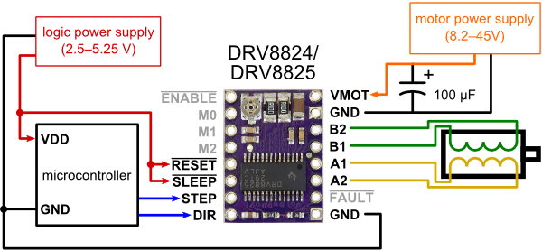

# quad_stepper
Arduino program to synchronize a stepper motor to a quadrature rotation sensor, multiplied by a fraction.

I developped this for my gear cutting rig - a milling machine with a hob cutter attached to a rotary encoder and a 4th axis holding the gear workpiece to be cut. The division is perfomed by a variant of the Bresenham algorithm that is normally used for drawing straight lines on bit mapped displays. In order to divide by fractional factors, stepper motor steps has to be regularily omitted. This would be impossible with full stepping, but works with a certain degree of microstepping.

## Developed with
- Arduino development environment 1.6.7 om Mac OS X
- SparkFun Pro Micro 5V/16MHz
- Pololu DRV8825 stepper driver
- ebay item: NEW 4 PCS/ lot 360P/R Output DC5~24V AB 2ph Shaft 6mm 5000rpm Rotary Encoder
- ebay item: 4th Axis Hollow Shaft CNC Router Rotational A Axis Φ100MM 4 Jaw Dividing Head

##Connections

Connect Arduino pin function - to
- RXI dirOut - Pololu DIR
- TXO stepOut - Pololu STEP
- 2 q0In - rotary encoder quadrature phase 0
- 3 q1In - rotary encoder quadrature phase 1
- 7 ms0Out - Pololu M0
- 8 ms0Out - Pololu M1
- 9 ms0Out - Pololu M2

## Serial commands

The arduino USB Serial inteface is used to send command from a computer to the arduino, for setting frequency multipliter and divider, and microstepping mode.
The USB serial interface appears under vaious names depending on OS etc.
- In the arduino environment it can be accessed by the serial console
- On Linux it may be /dev/ttyUSB0 or /dev/ttyACM0
- On OS X it may be /dev/cu.usbmodem1411, number varies

Commands
- set m x - set the multiplier to x
- set d x - sets the divider to x
- set ms x - sets the microstepping mode to x
- get - prints all parameter values

All commands are terminated by newline. 
Multiplier m must be less than or equal to divider d.
Parameters are stored in EEPROM, and restored at power-on.

### Microstepping modes
- 0 - 1/1 (no microstepping)
- 1 - 1/2
- 2 - 1/4
- 3 - 1/8
- 4 - 1/16
- 5 - 1/32
- 6 - 1/32
- 7 - 1/32

